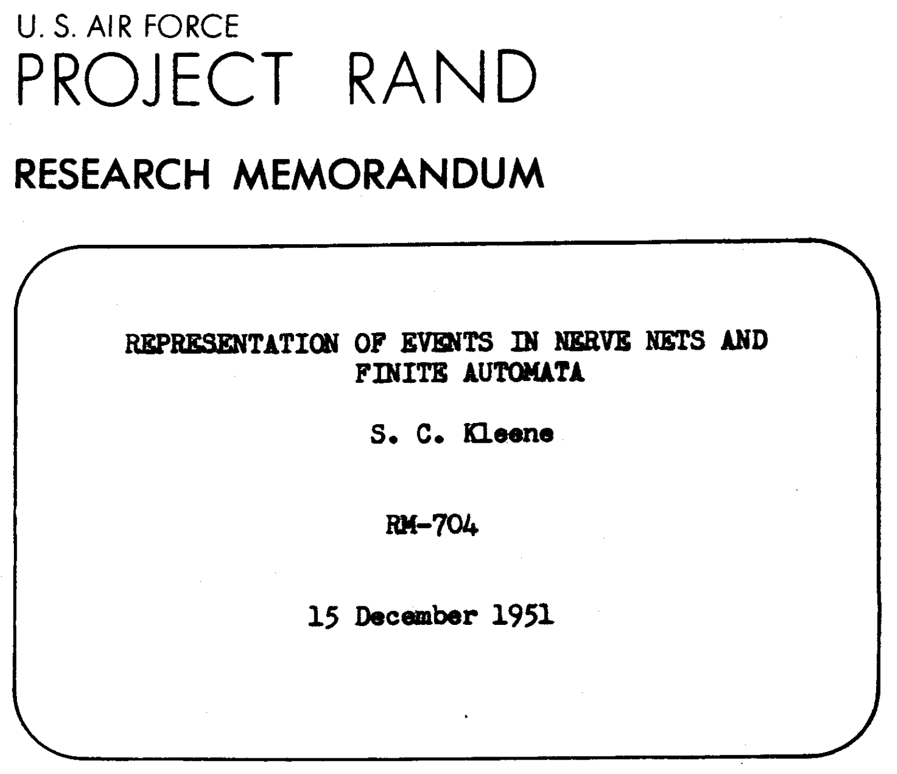

# (reg)Express Yourself!

Wherefore regex? This workshop is (supposed) to do several things at once. It might be actually practical insofar as regular expressions are incredibly helpful wide range of use cases. It might spur a community of practice because many of us use some subset of regular expressions and, more generally, have amassed specific technical solutions that we do not often get to share.

It might even (gently) model a digital scholarship "worldview." Tools we use everyday like regular expressions have complex social and political histories as well as equally complex implications. These tools come out of very specific, sometimes surprising, assumptions about how humans and machines are supposed to govern each others behavior. Thinking about these tools while also working with them lets us step back from our machines and opens a little space. At best, such space empowers us not only to become a little more familiar with the machines that facilitate our lives but also to defamiliarize them, to unearth the very human and peculiar decisions that went into their design and near universal adoption.

In this session, we will:

- learn a little about the history and application of regular expressions
- cover a couple basic computing terms
- practice regex basics including character classes, anchors, character sets, quantifiers, and capture groups
- work on exercises including cleaning up data, transforming data, 

-----

[Why RegEx?](sections/why-regex.md)

[Key terms](sections/key-terms.md)

[Regex basics](sections/regex-basics.md)

[Exercise 1: Cleanup](sections/cleanup.md)

[Exercise 2: Normalize](sections/normalize.md)

[Exercise 3: Transform](sections/transform.md)

[Introducing OpenRefine](sections/introducing-openrefine.md)

[Exploring OpenRefine](sections/exploring-openrefine.md)

## Resources

[OpenRefine Introductory Video Tutorials](http://openrefine.org/)

[Programming Historian's Cleaning OCR with Regular Expressions](https://programminghistorian.org/en/lessons/cleaning-ocrd-text-with-regular-expressions)

[Programming Historian's Understanding Regular Expressions](https://programminghistorian.org/en/lessons/understanding-regular-expressions)

[Johnny Fox on Medium: Regex Cheatsheet By Examples](https://medium.com/factory-mind/regex-tutorial-a-simple-cheatsheet-by-examples-649dc1c3f285)

[Johnny Fox on Medium: Regex Most Wanted](https://medium.com/factory-mind/regex-cookbook-most-wanted-regex-aa721558c3c1)

[Goyvaerts, Regular Expressions: The Complete Tutorial](https://www.princeton.edu/~mlovett/reference/Regular-Expressions.pdf)

-----

