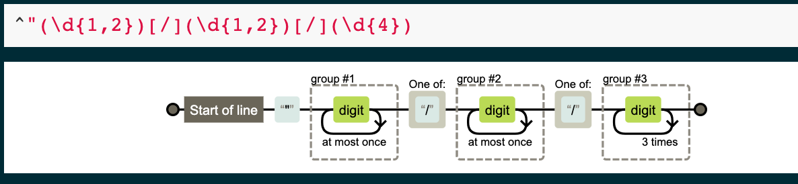

[<<< Previous](cleanup.md) | [Next >>>](transform.md)

# Data Normalization

Here were are going to reformat the date field of a dataset, first in Visual Code Studio and then in OpenRefine.

We'll begin with the :alien: data again but note that I've included some other data in our data folder.

Using Visual Code Studio find and replace: 

Using GREL for OpenRefine: `value.replace(/(\d{1,2})\/(\d{1,2})\/(\d{4}).*/,'$3-$1-$2')`

