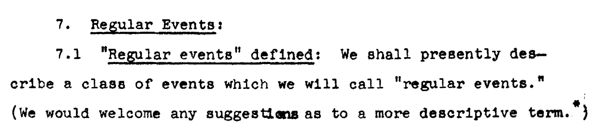

[Next >>>](key-terms.md)

# Why Regex?

### What regular expressions are not:

- Any particular software
- A programming language
- Particularly user friendly let alone uniform across platforms

### A digression

### Who uses them anyway?

Things I've used regex for in two months:

- Format exported captions (extra carriage return).
- Edit Tripod URLs, replacing last four digits of Alma ID.
- Update `http` to `https` across several sites.
- Extract URLs for images from HTML page.
- Rearrange columns in a table.
- Turn form responses in a table into a readable document.
- Find-and-Replace across multiple files.
- Find doubled characters, words, or phrases.

(Thanks Code4Lib ListServ!)

- Finding phone numbers for a particular range of exchanges in a large document and changing the area code.   
- Reversing all names of a transcript (e.g.  lines start with <first> <last>: "quote" and become <last>, <first>: "quote").   
- Finding every instance of an email address *not* followed by a particular domain name. 
- Changing every date reference in a particular format to a different format (e.g. MM/dd/yy to yyyy.MM.dd) without affecting other numerical references (e.g. scores like 93/100, or 6/10).

But also little things like:

- Validate passwords.
- Search and indexing.
- Route traffic on a server, making sure web addresses go to the right locations (e.g., Apache, Drupal).
- Resolve email addresses.
- Resolve domain names into IP addresses and route internet traffic.
- Parse metadata at scale, whether ITS security team using Splunk on server logs to the NSA identifying suspicious exchanges.